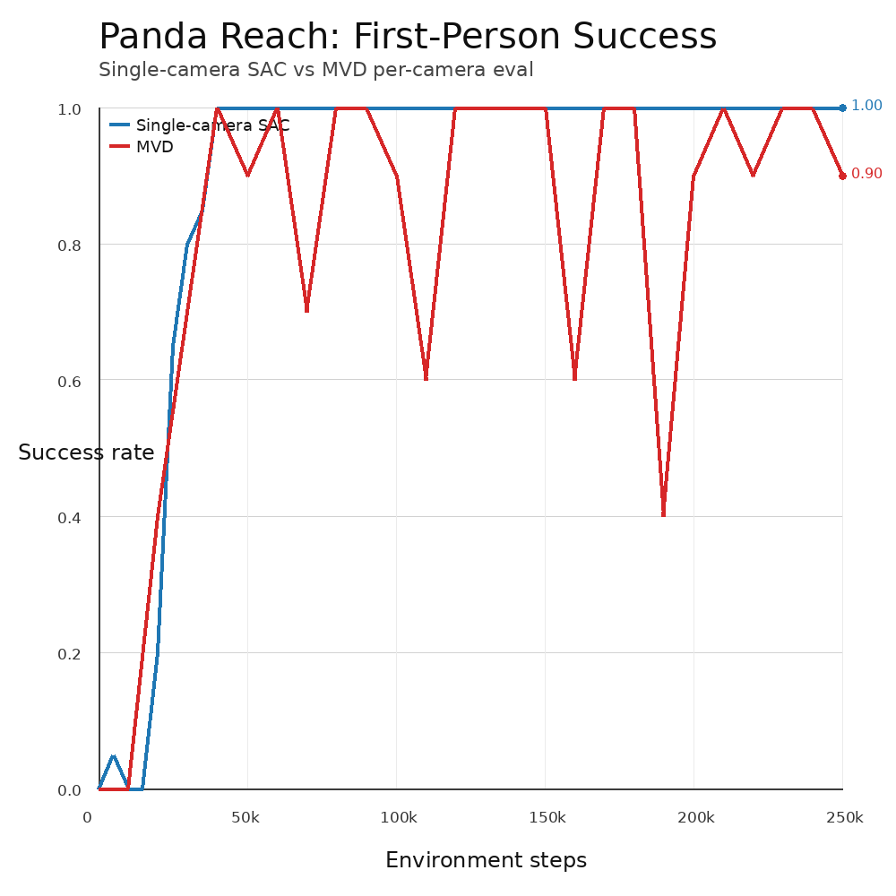
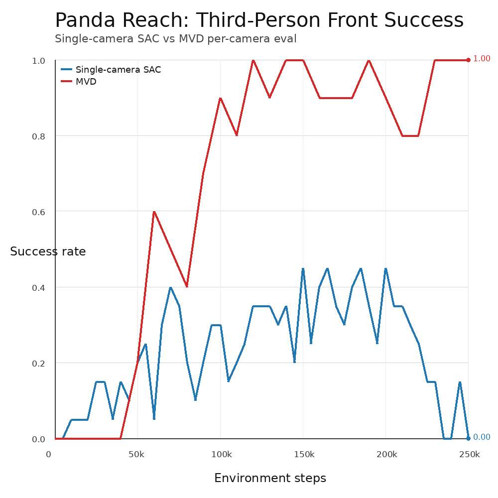
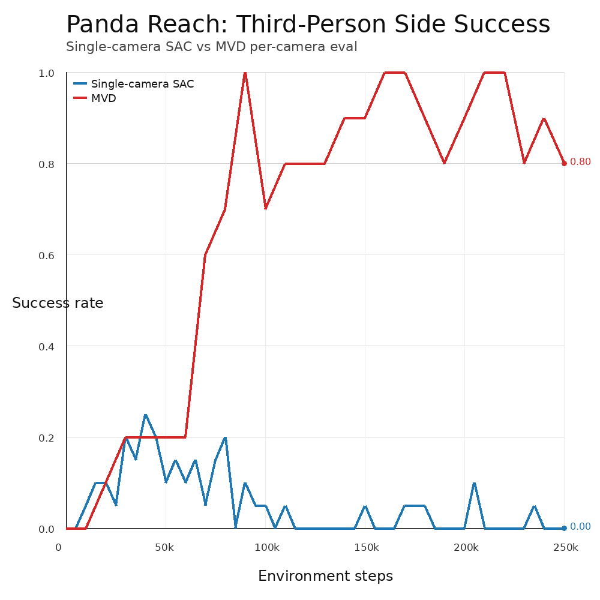
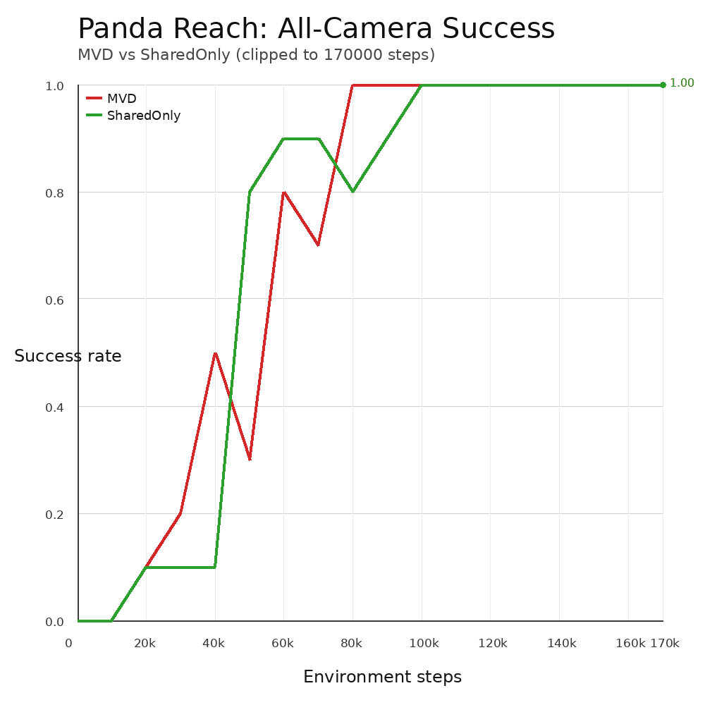
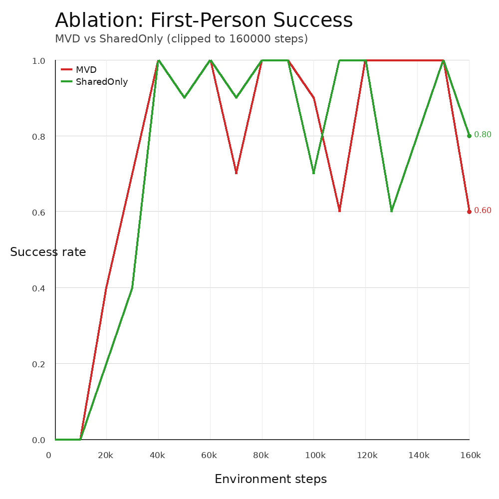
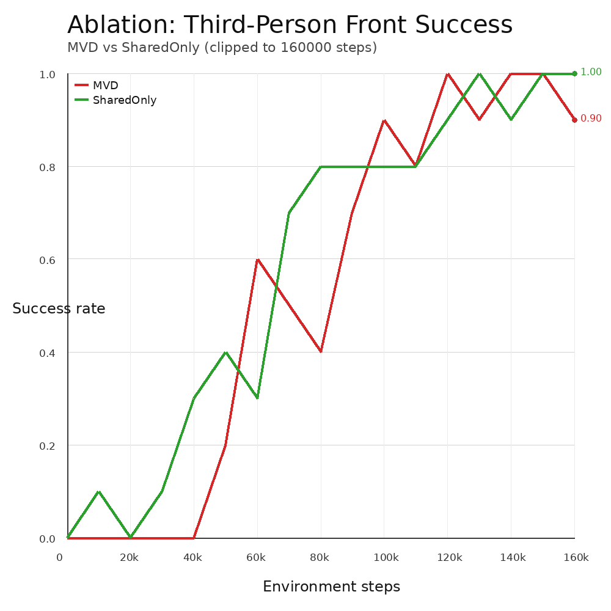

# Panda Reach Reproduction Notes

This repository now contains a focused workflow for the Panda Reach reproduction and shared-only ablation runs we executed.

Original project README was preserved as `paper_readme.md`.

## What We Ran

We used seed `73` across three machines:

- `pc1`: single-camera runs (`first_person`, `third_person_front`, `third_person_side`)
- `pc2`: full MVD run (`panda_reach_sac_mvd_repro`)
- `pc3`: shared-only ablation (`panda_reach_sac_mvd_shared_only_ablation`)

The raw archives are in `remote_results/pc*/pc*.zip` and extracted data is in `remote_results/pc*/extracted/`.

## Environment Setup

```bash
conda env create -f conda_env.yml
conda activate multi_view_disentanglement
bash scripts/preflight_remote.sh
```

For headless remote machines, we ran commands with `xvfb-run -a`.

## Reproduction Runner Script

Use the runner script for end-to-end execution (main reproduction + shared-only ablation):

```bash
MAX_JOBS=4 GPU_ID=0 USE_XVFB=1 ./scripts/run_panda_repro_and_shared_only.sh
```

What it does:

- Runs on `main`:
  - single-camera SAC baselines (first/front/side)
  - MVD run
- Switches to `abl/shared_only`:
  - shared-only ablation run
- Stores logs in `run_logs/` and results in `runs_repro/` and `runs_ablation/`
- Writes commit hashes to `run_meta/`

## Plotting Remote Results

We added a no-dependency plotting script that reads CSVs and writes PNG figures.

```bash
python3 scripts/plot_remote_results.py
```

This script:

- Extracts zip files into `remote_results/pc*/extracted/` if needed
- Selects the best available run per experiment (highest step horizon)
- Writes plots to `images/`
- Writes summary table to `remote_results/analysis_summary.md`

## Generated Figures

All generated images are under `images/`:

- `images/all_cameras_mvd_vs_shared_only.png`
- `images/camera_first_single_vs_mvd.png`
- `images/camera_front_single_vs_mvd.png`
- `images/camera_side_single_vs_mvd.png`
- `images/ablation_first_mvd_vs_shared_only.png`
- `images/ablation_front_mvd_vs_shared_only.png`
- `images/ablation_side_mvd_vs_shared_only.png`

### Main Reproduction: MVD vs Single-Camera (3 Views)

| First-Person | Third-Person Front | Third-Person Side |
| --- | --- | --- |
|  |  |  |

### Ablation: MVD vs Shared-Only

| All cameras | First-Person | Third-Person Front | Third-Person Side |
| --- | --- | --- | --- |
|  |  |  |  |

## Notes on Comparability

- These results are single-seed (`73`) only.
- Eval settings differ across runs:
  - singles on `pc1`: `eval_freq=5000`, `num_eval_episodes=20`
  - MVD/shared-only on `pc2`/`pc3`: `eval_freq=10000`, `num_eval_episodes=10`
- Shared-only run is partial (up to ~170k), while MVD reaches 250k.

For the extracted numeric summary, see `remote_results/analysis_summary.md`.
